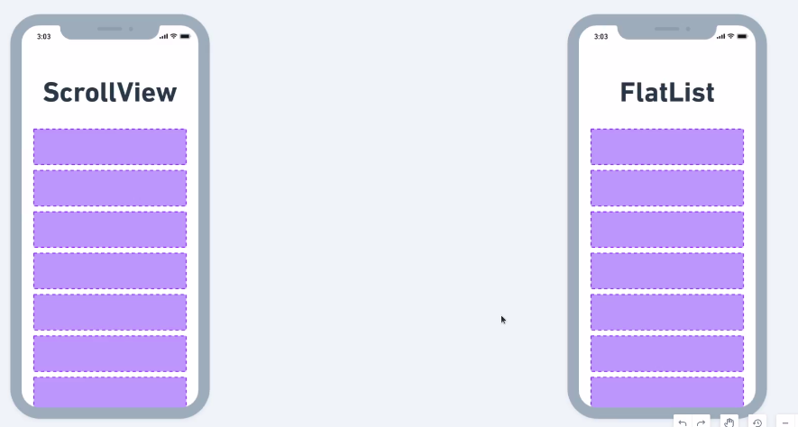

# Fundamentos React Native

### Renderização no React Native

**A ponte do React Native atua como um intermediário entre o código JavaScript do React e as plataformas nativas iOS e Android.**

**Ela converte os elementos React em elementos nativos específicos de cada plataforma.**

Por exemplo, um botão React pode ser convertido em um **UIButton** no iOS e um **Button** no Android.


**Os elementos nativos convertidos pela ponte do React Native são então renderizados pelas plataformas iOS e Android usando seus próprios mecanismos de renderização.**

O resultado final é uma interface de usuário nativa que pode ser executada em diferentes dispositivos.


### Densidade de pixels

Existem dois pixels:

- O **pixel de hardware** é de fato o ponto de luz na tela;
- Já o **pixel de software** é dinâmico e de acordo com a densidade de pixels na tela;

> A Densidade de Pixels é o número total de pixels que existe dentro de um área física da tela (PPI - pixels per inch, ou pixel por polegada);


Quanto mais perto do dispositivo mais detalhes de visualização será requerido, ou seja, será necessário uma maior densidade de pixels (smartphone e tablet), quanto mais distante, menor poderá ser a densidade de pixels (TV, Projetores);


#### Independência de Densidade

Foi criado uma medida que renderiza os elementos de uma forma independente das características e densidades de cada dispositivo. **Android - DPI** ('dots per inch', ou 'pontos por polegada') e iOS (points);


---

### Export e Export Default

Na exportação de um componente sem **default (nomeada)** fazemos a importação entre **chaves {}**, podemos importar várias funções, váriaveis...

```js
  // Exportação nomeada
  export function Home(){
    ...
  }
  // Importando
  import {Home} from './Home'

```

Na exportação **com default** não escolhemos exatamente o que queremos lá de dentro, **sem as chaves {}**

```js
  // Exportação nomeada
  export default function Home(){
    ...
  }
  // Importando
  import Home from './Home'

```

### Rolagem



A **Scroll View** `<ScrollView></ScrollView` é utilizada para fazer uma rolagem para vários elementos quando não cabem em tela, utilizamos o map e retornamos o elemento a ser iterado, porém a ScrollView **renderiza(carrega)** todos os elementos dessa lista.

- **Recomendada para listas pequenas**

```jsx
<FlatView>
  {participants.map(participant => (
    <Participant
      key={participant}
      name={participant}
      onRemove={() => handleParticipantRemove(participant)}
    />
  ))}
</FlatView>
```

Existe também a FlatList `<FlatList />` ela é diferente pois utilizamos as próprias propriedades desse componente para realizar a iteração, já a FlatList **não renderiza desnecessáriamente** os elementos que não vão aparecer **(muito mais perfórmatica)**

- **Recomendada para listas muito grandes, buscar dados**

```jsx
<FlatList
  data={[]}
  keyExtractor={item => item}
  renderItem={({ item }) => (
    <Participant
      key={item}
      name={item}
      onRemove={() => handleParticipantRemove(item)}
    />
  )}
  ListEmptyComponent={() => (
    <Text style={styles.listEmptyText}>
      Adicione participantes a sua lista de presença
    </Text>
  )}
/>
```

- A propriedade `ListEmptyComponent` é usado para renderizarmos quando não tem nada no array, ai podemos renderizar outro **componente** para avisar ao usuário.

---

### Hooks

São **funções** que permitem o uso de estados e outros recursos do React sem escrever um classe, **Encapsula funcionalidades e facilita o reaproveitamento da sua lógica**.

- **useState**: Hook para criar e acessar estados na aplicação;
- **useEffect**: Hook Dispara uma determinada lógica toda vez que for renderizada;

Quando trabalhamos com variaveis **'tradicionais'**, método **push** por exemplo, elas não geram novas renderizações e não exibem na tela no React, por isso que precisamos usar o **estado** com hooks, para refletir na renderização.

### Imutabilidade

Geralmente há duas maneiras de alterar dados:

- A **primeira** é mutar o dado alterando diretamente seu valor;
- A **segunda** maneira é substituir o dado antigo por uma nova cópia com as alterações desejadas;

#### Detectar Mudanças

**Detectar mudanças e objetos mutados é difícil**, pos, eles são modificados diretamente. Essa detecção requer um objeto mutado para ser comparado com as cópias das suas próprias versões anteriores e a árvore inteira do object para ser cruzada.

D**etectar mudanças em objetos imutáveis é consideravelmente fácil.** Se ele for diferente do anterior, o objeto foi alterado;

#### Benefícios

Como os dados imutáveis podem determinar facilmente se ocorreram alterações, isso também ajuda a determinar quando um componente deve ser renderizado novamente.

---

### Renderizações

Antes dos componentes serem exibidos na tela eles devem ser **renderizados** pelo React.

#### Há duas razões para um componente renderizar

**1 - Quando é a renderização inicial do componente**;
**2 - O estado do componente mudou**;

- Depois de acionar uma renderização o React chama seus componentes para descobrir o que exibir na tela;
- Após renderizar(chamar) seus componentes, o React **modificará o Dom**.
- Para a **renderização inicial** o React usará a API DOM para colocar todos os nós DOM criados na tela;
- Para **re-renderizações** o React aplicará as operações mínimas necessárias (calculadas durante a renderização) para fazer o DOM corresponder à saída de renderização mais recente.

#### Qualquer atualização de tela em um aplicativo React acontece em três etapas:

- **1 - Acionar**;
- **2 - Renderizar**;
- **3 - Comprometer-se**;

O react não toca no DOM se o resultado da renderização for o mesmo da última vez
