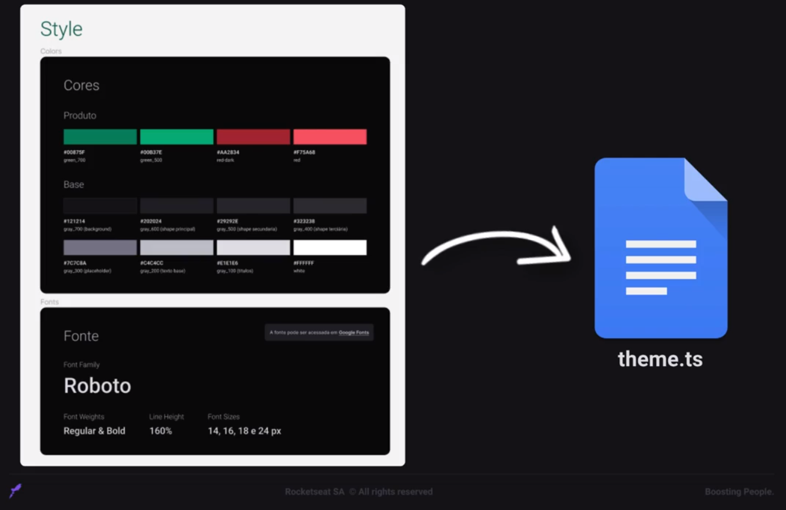

# StyleSheet X Styled Components

Tanto o StyleSheet nativo quanto o Styled Components são ferramentas valiosas para estilizar componentes no React Native, mas cada um possui características e vantagens distintas que influenciam na escolha ideal para o seu projeto. Analisando as principais diferenças entre eles:

| Característica | StyleSheet         | Styled Components                 |
| -------------- | ------------------ | --------------------------------- |
| Solução        | Oficial            | Terceiros                         |
| Sintaxe        | Objetos JavaScript | Componentes React                 |
| Ideal para     | Estilos básicos    | Estilos complexos e reutilizáveis |
| Flexibilidade  | Menor              | Maior                             |
| Reutilização   | Dificultada        | Facilitada                        |
| CSS-in-JS      | Não suportado      | Suportado                         |
| Aprendizado    | Simples            | Mais complexo                     |
| Desempenho     | Mais leve          | Potencial impacto                 |

---

# Design System | Style Guide

### Design System

É uma coleção de componentes padronizados e reutilizáveis;

### Style Guide

Documento (guia) que define as diretrizes de estilos como por exemplo, tamanhos das fontes, cores, etc...

#### Exemplo de Style Guide

