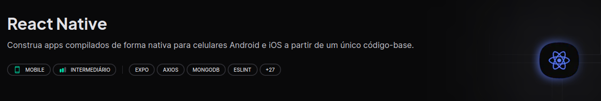

  

# 💚 Ignite 💚

 

  

    <a href="#projects">Projetos</a>&nbsp;&nbsp;&nbsp;|&nbsp;&nbsp;&nbsp;
    <a href="#autor">Autor</a>&nbsp;&nbsp;&nbsp;
  

---

### 🎯 Breve Resumo

Códigos/cursos feitos na plataforma da Rocketseat no curso do **Ignite**, repositório criado para estudos/aprofundamento.

#### Descrição:

<!-- - Landing pages, formularios, menus;
- Grid, FlexBox, Sass;
- Vários cursos e projetos próprios;
- Todos muito bem documentados;
- Consumo de apis;
- Projetos em VueJs; -->

---

# 📱 Trilha React Native 

## 👾 Projetos 

  <strong>Evento Fictício</strong>

  

- Projeto desenvolvido em **Expo** para introdução aos conceitos do **ReactNative** como, **componentes**, **props**;
- Projeto inicial que simula uma lista de convidados, com as funcionalidades de **Adicionar** e **Remover** participantes na lista, com **Validação** se o nome do usuário ja existe;
- Conceito de **Hooks**:
  - **UseState**;
- No ReactNative o padrão de css é **Flex**;
- Aprendido os conceitos de **FlatList** e **ScrollView**, **TouchableOpacity**, **TextInput**;

#### Mobile Screenshot:

---

  
### 🚧 Projetos em fase de Construção...⏳
##### Mais projetos em breve...

---

## 🏆 Desafios 

<strong>To-do</strong>
  

- **Desafio 01** da Trilha **ReactNative**;
- **Aplicação** de **controle de tarefas** no estilo **to-do list**, que contém as seguintes funcionalidades:
  - **Adicionar** uma nova tarefa;
  - **Marcar** e **desmarcar** uma tarefa como **concluída**;
  - **Remover** uma tarefa da listagem;
  - Mostrar o **progresso** de **conclusão das tarefas**;
- **Conceitos utilizados:**
  - **Estados**;
  - **Imutabilidade** do estado;
  - **Listas** e **chaves** no React Native;
  - **Propriedades**;
  - **Componentização**;

### 🚧 Desafios em fase de Construção...⏳

##### Mais desafios em breve...

---

### 👤 Autor 

### [Savio Nascimento](https://github.com/savionascimentodev)

`🛠 Full Stack Developer`
`📍Nova Mutum - Brazil`

  

 

---

  

 

[⬆️ Topo](#top)
